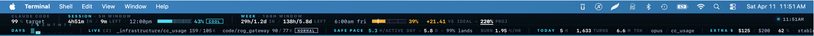
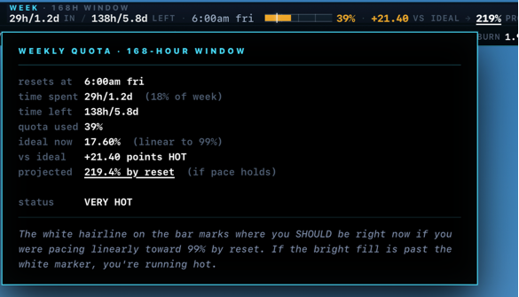
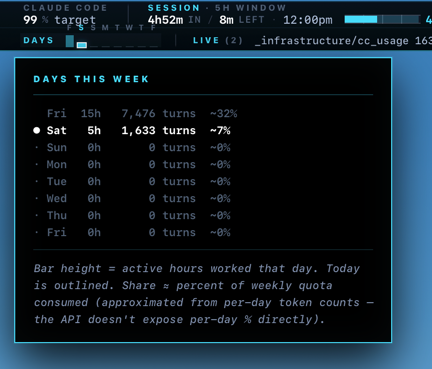

# cc-usage

**The only always-visible quota instrument for Claude Code.**
A macOS menu-bar widget + granular SQLite tracker + pacing CLI, built for
developers on the Claude **Max** plan who refuse to get surprised by
"you've used 99% of your weekly quota" at 3pm on a Thursday.



> A full-width Bloomberg-terminal strip pinned to the top of your
> screen. It shows where you are on your current 5-hour session AND
> your 7-day rolling window, side by side with *where you should be*
> if you want to land at 99% by the weekly reset. No tab-switching,
> no `/status`, no surprise lockouts.

---

## Why this exists

Anthropic ships a `/status` command inside Claude Code. It's fine. It
tells you a percentage. But it doesn't tell you:

- **Am I on pace?** If I'm 60% through my weekly quota and 40% through
  the week, I'm burning hot. By how much? Will I hit 100% by Thursday?
  By Tuesday?
- **What burned it?** Was it that one refactor on Monday? The
  subagent that got stuck in a Bash loop? A specific repo?
- **What's my real rate per active hour?** Not per wall-clock hour —
  per hour I was *actually working* — so I can calibrate "10% remaining
  = 6 more hours of normal work" vs "10% remaining = 30 minutes of
  what I was just doing."
- **Is my local burn even matching what Anthropic says I used?**
  (It usually is. But the drift-check tells you when it isn't.)

cc-usage answers all of these. And it puts the answer in your menu bar
so you don't have to ask.

---

## Features

### 1. Always-on menu bar widget

Built on [Übersicht](http://tracesof.net/ubersicht/). Two stacked bars
(session + weekly) with:

- **Quarter-tick calibration marks** on each bar (this is a
  measurement instrument, not a dashboard)
- **A single hairline target marker** on the weekly bar showing *where
  you should be right now* if you want to land at your target % by the
  reset — not at 100%, at 99% or whatever you set
- **Color semantics:** monochrome base + one electric cyan accent.
  Amber only as a warning semaphore. **No red** — colorblind-safe,
  signals critical state by underlining the number, not recoloring it
- **A pulsing live dot** next to the last-updated timestamp — the only
  moving element in the widget, so you can tell at a glance it's live
- **Never stale, never errors:** the widget keeps a locally-calibrated
  `%-per-Mtoken` ratio and extrapolates session% and week% forward
  from the last successful API snapshot using per-turn token burn
  from your local SQLite — so when Anthropic rate-limits the
  `/api/oauth/usage` endpoint for hours at a time (yes, that happens),
  the widget still paints current-to-the-minute numbers. Session
  windows rolling over at the 5-hour boundary are detected and
  reset to 0% automatically. It will **never** paint a red error
  splash across your menu bar.

#### Weekly quota detail popover



Click the weekly bar and you get the full calibration readout: how
much time has passed in the 168-hour window, how much quota you've
actually used, where "ideal now" is (the white hairline target
marker), your delta against ideal (with a heat label —
`COOL / ON PACE / HOT / VERY HOT`), and the projected landing if your
current pace holds. The cursor below the bar walks left or right of
the target marker to make the direction of drift unmistakable.

#### Days-this-week popover



Click through to see per-day quota consumption since the weekly reset
— bar height proportional to active hours worked, turn counts
annotated, and your pct_share of the weekly bucket computed by
token-contribution since the API doesn't expose per-day % directly.
Today is highlighted with an outlined bar.

### 2. Forensic-grade SQLite tracker

Every time Claude Code writes a JSONL line into `~/.claude/projects/`,
cc-usage parses it into six normalized tables:

| Table          | What it holds |
|----------------|---------------|
| `snapshots`    | Polls of `/api/oauth/usage` (Anthropic's authoritative quota %) — every 15 min by the launchd agent |
| `turns`        | One row per assistant message: input/output/cache tokens, model, project, duration, stop reason |
| `tool_calls`   | One row per `tool_use` block (tool name, input JSON, payload size) |
| `tool_results` | One row per `tool_result` (error flag, result size), paired with `tool_calls` via `tool_use_id` |
| `user_prompts` | One row per user event (real prompts + tool wrappers), with length and pasted-image counts |
| `events`       | Catch-all for non-turn events (turn durations, permission-mode flips, attachments, last-prompt, etc.) |

Every table has a stable UUID as its `UNIQUE` key, so the backfill is
**idempotent** — rerun it against any JSONL history, any number of
times, and it never doubles up.

### 3. Pacing + forecasting CLI

```sh
cc-usage                   # full panel with pacing and constraint picker
cc-usage --charts          # + hourly + daily burn charts
cc-usage --report          # + per-model and per-project breakdowns
cc-usage --search my-repo  # filter everything by project substring
cc-usage --validate        # drift check: Anthropic quota Δ% vs local token burn
cc-usage --target 95       # recalibrate against a different weekly target %
```

Sample output:

```
  Claude Code usage · Sat Apr 11, 11:47AM PDT · target 99%
  ────────────────────────────────────────────────────────────────────────

  Current session (5h window)
  ██████████████████████░░░░░░░░░░░░░░░░░░░░░░░░░░░░
   43.0% used ·  57.0% left · 13m to reset (Sat Apr 11, 12PM)
  safe: 272.01%/h   ·   recent:  0.00%/h over 44m   →   plenty of headroom
  session rate:  8.60%/active-hour (5h · 1633 turns) → 6.63h of work fits in the 57% remaining

  Weekly — all models
  ████████████████████░░░░░░░░░░░░░░░░░░░░░░░░░░░░░░
   39.0% used ·  61.0% left · 5.8d to reset (Fri Apr 17, 6AM)
  on-pace-for-99% baseline: 17.56% (you're +21.44% AHEAD)
  to land at 99% by Fri Apr 17, 6AM: 10.42%/day budget for 5.8d
  recent burn:  0.00%/day over last 44m   →   projected landing  39.0%

  Weekly — Sonnet only
  █████░░░░░░░░░░░░░░░░░░░░░░░░░░░░░░░░░░░░░░░░░░░░░
   10.0% used ·  90.0% left · 2.8d to reset (Tue Apr 14, 7AM)
  on-pace-for-99% baseline: 59.39% (you're -49.39% behind)

  ────────────────────────────────────────────────────────────────────────
  Constraint: Weekly — all models — keep burn under 10.42%/day to land at 99%.

  Observed rate this week :  1.95%/active-hour (over 20 active hours · 9109 turns)
  Tomorrow's budget       :  5.34 active hours (10.42%/day)   →   steady
```

(Full sample with charts: [`docs/sample-output.txt`](docs/sample-output.txt))

The **Constraint picker** is the secret sauce: it looks at all three
quota dimensions (5h session, 7-day all-models, 7-day Sonnet) and
picks whichever is *actually going to bite you first* given your
current burn rate. That's the bar the widget anchors on.

### 4. `stats.py` — the behavioral X-ray

```sh
python stats.py              # full report
python stats.py --days 7
python stats.py --project my-repo
python stats.py --today
```

Thirteen sections of "what did Claude actually do with my tokens":

1. Overview (row counts, date range)
2. Token burn — by day, by model, cache hit rate
3. Projects — top by tokens, turns, tool calls, avg turns/session
4. Tools — inventory, call counts, error rates
5. Tool-specific — top Bash commands, top Grep patterns, Read hot files
6. Turn behavior — stop_reason distribution, iterations, duration
7. Thinking vs visible output ratio
8. User activity — prompts per day, text length, screenshot pastes
9. Sessions — length distribution, longest, turns per session
10. Hourly heatmap — turns by hour-of-day
11. Errors — API errors, tool result errors
12. Permission modes — plan / accept_edits / default distribution
13. Sidechain tax — token share of subagent turns

### 5. Max-plan drift validation

```sh
cc-usage --validate
```

Compares the Anthropic-reported Δ quota % against your locally-measured
token burn over the same interval. If the API says "you went from 40%
to 50%" and your local turns table says "I wrote 8M tokens in that
window," you can compute a `%/Mtok` rate per model and detect whether
Anthropic's metering drifts from what it should be.

Useful for two reasons:

1. **Sanity** — confirms the `/api/oauth/usage` endpoint actually does
   what the docs say
2. **Forecasting** — once you know your stable `%/Mtok`, the CLI can
   translate "I have 10% left" into "I have ~1.8M output tokens left"

---

## Install

### Requirements

- **macOS** (the widget depends on Übersicht; the rest is cross-platform)
- **Python 3.9+** with `requests` installed AND macOS Full Disk Access
  granted. The stock `/usr/local/bin/python3` usually fails Full Disk
  Access — the easiest workaround is to use a virtualenv whose parent
  directory is already on the Full Disk Access list. Most devs have
  one.
- [**Übersicht**](http://tracesof.net/ubersicht/) — `brew install --cask ubersicht`
- An active **Claude Code** installation. cc-usage reads your OAuth
  token from the keychain (read-only, never refreshed) and your JSONL
  history from `~/.claude/projects/`.

### One command

```sh
git clone https://github.com/<you>/cc-usage.git
cd cc-usage
./install.sh /absolute/path/to/your/python3
```

That script will:

1. Initialize the SQLite schema at `data/claude_usage.db`
2. Copy the Übersicht widget into
   `~/Library/Application Support/Übersicht/widgets/cc-usage.jsx`,
   rewriting `PYTHON_BIN` and `REPO_ROOT` for your machine
3. Render and install the launchd agent at
   `~/Library/LaunchAgents/com.cc-usage.snapshot.plist`, then
   `launchctl bootstrap` it so it starts firing immediately
4. Smoke-test the widget JSON payload end-to-end

Afterwards, add a shell alias for interactive CLI use:

```sh
alias cc-usage='/path/to/python3 /path/to/cc-usage/claude_code_usage.py'
```

Then backfill your historical JSONL data (first run only — this can
take a few minutes if your `~/.claude/projects/` has months of logs):

```sh
python claude_usage_backfill.py --since all
```

### Configuration

- `CC_USAGE_TZ` env var — IANA timezone for local-time displays. Default
  `America/Los_Angeles` (matches Anthropic's quota reset convention).
- `--target N` CLI flag — weekly target percentage (default 99). Lower
  it if you prefer to land earlier than the reset.

---

## Architecture

```
    Claude Code CLI             Anthropic API
    ────────────────            ──────────────
    writes JSONL turns          /api/oauth/usage
    to ~/.claude/projects       (OAuth + beta hdr)
            │                          │
            │                          │
            ▼                          ▼
    ┌─────────────────┐       ┌─────────────────┐
    │    backfill     │       │ snapshot poller │
    │  (idempotent,   │       │ (launchd every  │
    │  UUID-keyed)    │       │     15 min)     │
    └────────┬────────┘       └────────┬────────┘
             │                         │
             ▼                         ▼
        ┌─────────────────────────────────┐
        │  SQLite — data/claude_usage.db  │
        │  snapshots / turns / tool_calls │
        │  tool_results / user_prompts    │
        │  events                         │
        └──────────┬──────────┬───────────┘
                   │          │
                   │          │
                   ▼          ▼
          cc-usage CLI   --widget-json
          (panel, charts,      │
          reports, validate)   ▼
                          ┌─────────────┐
                          │  Übersicht  │
                          │   widget    │
                          └─────────────┘
```

Key design decisions:

- **SQLite, not Postgres or DuckDB.** One file. Zero daemons. Every
  query runs in single-digit milliseconds against months of history.
- **Backfill is a separate binary.** The 15-min launchd snapshot
  spawns it as a subprocess with a 2h overlap window — so a backfill
  failure never crashes the snapshot step (the more critical of the
  two), and the overlap is free because every row has a UNIQUE UUID.
- **The widget talks to the DB, not the API.** Its 60-second render
  loop reads the most recent `snapshots` row as a calibration anchor,
  then extrapolates session% and week% forward using turn-level token
  burn and an empirically-fit `%-per-Mtoken` ratio. That means the
  widget is always live-to-the-minute AND never hits the API on its
  own render path — so it can't possibly contribute to rate limits.
  The 15-min launchd agent is the only thing that actually touches
  `/api/oauth/usage`, and when *that* gets 429'd, the extrapolation
  simply keeps projecting forward from whatever the most recent
  successful snapshot was.
- **OAuth token is read-only, never refreshed.** Refreshing rotates
  the token and kicks the live Claude Code CLI back to `/login`. We
  deliberately avoid that code path and just re-read from keychain on
  every invocation.

---

## FAQ

**Does this work with the Claude Pro plan, or only Max?**
The `/api/oauth/usage` endpoint is exposed for both, but the quota math
(session × weekly × Sonnet-specific) is designed around the Max plan's
three-window structure. Pro users get one window; the widget will just
show the weekly bar in that case.

**Does this modify anything in `~/.claude/`?**
No. Reads only. The OAuth token is read from the macOS keychain with
`security find-generic-password`. The JSONL files are read-only-mmap'd
during backfill.

**Will it blow up my rate limits?**
The widget refreshes every 60s but its render path never touches the
API — it uses the local DB as a calibration anchor and extrapolates
forward from per-turn token burn. Only the 15-min launchd agent
actually polls `/api/oauth/usage` (96/day, 672/week), and that's well
under any published limit. In practice Anthropic will *still*
sometimes 429 you for hours at a time on this endpoint, and when that
happens the widget just keeps extrapolating from the last successful
snapshot — you'll see numbers that stay current to the minute even
while the API is locking the launchd agent out. You will never see a
red error bar.

**Can I move the repo after install?**
No — the widget, launchd plist, and shell alias all reference absolute
paths written at install time. Either re-run `./install.sh` or
hand-edit those three files.

**How big does the DB get?**
Depends on how much you use Claude Code. A heavy-user year's worth of
per-turn rows with full content snapshots is in the low hundreds of
megabytes. The schema VACUUMs cleanly if you want to trim it.

---

## License

MIT.

## Not affiliated with Anthropic.

This is a third-party tool that reads your own local Claude Code state
and the public `/api/oauth/usage` endpoint. Don't @ them about it.
